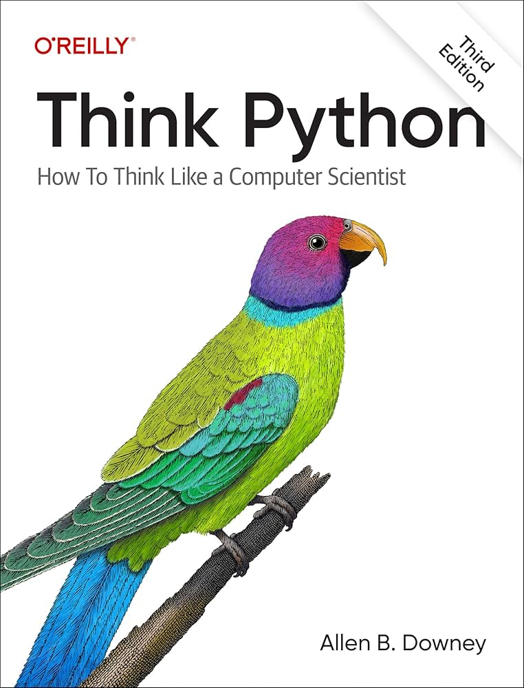

# 🐦 Think Python - Resoluções dos Exercícios
Bem-vindo! Este repositório contém as resoluções dos exercícos do livro *Think Python: How to Think Like a Computer Scientist*, de **Allen B. Downey**, feitas por mim durante a minha jornada de aprendizado com esse livro. As resoluções podem ser acessado utilizando **Jupyter Notebook** ou **Marimo**. 

| Capítulo     | Jupyter Notebook      | Marimo       |
|:------------:|:---------------------:|:------------:|
|   1          | [Link para o Jupyter Notebook](https://github.com/marcosnevary/think-python/blob/main/capitulo-1/capitulo_1.ipynb) | [Link para o Marimo](https://static.marimo.app/static/capitulo-1-u20f) |
|   2          | [Link para o Jupyter Notebook](https://github.com/marcosnevary/think-python/blob/main/capitulo-2/capitulo_2.ipynb) | [Link para o Marimo](https://static.marimo.app/static/capitulo-2-0594) |
|   3          | [Link para o Jupyter Notebook](https://github.com/marcosnevary/think-python/blob/main/capitulo-3/capitulo_3.ipynb) | [Link para o Marimo](https://static.marimo.app/static/capitulo-3-e6h6) |
